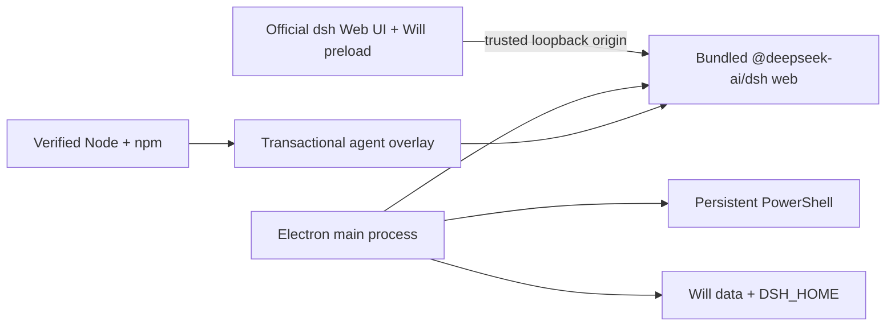

# DeepSeek Harness Will

English | [中文](README.zh.md)

<p align="center">
  
</p>

DeepSeek Harness Will is an **unofficial, community-maintained desktop distribution** of [DeepSeek Harness](https://github.com/deepseek-ai/deepseek-harness). It packages the official `dsh web` profile as a Windows 10/11 x64 desktop application and adds opt-in desktop features without changing the upstream default theme.

This project is not affiliated with or endorsed by DeepSeek. DeepSeek Harness remains in developer preview, so compatibility-breaking upstream changes are expected.

## Status

DeepSeek Harness Will is an early preview. The repository builds and the desktop-specific unit tests pass on macOS; the Windows workflow is the release authority for installer and portable artifacts.

| Capability | Status | Implementation |
|---|---|---|
| No user-installed Node.js | Implemented | Electron runs the bundled agent; releases also carry a verified Node/npm distribution for agent overlay updates. |
| Native desktop window | Implemented | Frameless glass title bar, single-instance behavior, tray residency, close-to-tray preference. |
| Portable mode | Implemented | The portable executable stores data in `DeepSeek-Harness-Will-Data` beside the executable. |
| UI skins | Implemented | Native upstream mode plus 10 mutually exclusive palettes: Windows XP, QQ98, Miku Future, Minecraft, Tonghuashun, Whale Song, Dunhuang, Cyber Neon, Paper Minimal, and Aurora. |
| Balance widget | Implemented | The main process queries DeepSeek's official `/user/balance` endpoint; the API key never crosses renderer IPC. |
| `soul.md` editor | Implemented | Projects the persona into a Will-owned dsh patch and does not overwrite the upstream profile patch. |
| Persistent PowerShell | Implemented | A main-process-owned shell runs in the project directory, survives Web page reloads and tray hiding, streams output over IPC, and replays the latest 128 KiB. |
| Plugin management | Implemented | Installs/removes dsh profile packages with an explicit arbitrary-code warning and restarts Harness safely. |
| Dual updates | Implemented | Transactional `@deepseek-ai/dsh@latest` overlay with health check/rollback, plus consent-gated GitHub Release client updates. |
| Task notification | Implemented | Sends a Windows notification when a visible agent run transitions to idle while the app is not focused. |
| Models, MCP, sessions, diff cards | Upstream | Reuses the official Web profile and its durable session/terminal/file-diff services. |
| Per-file/whole-session one-click restore | Planned | Diff display exists upstream; mutation rollback is not exposed as a Will action yet. |
| Codex/Claude automatic migration | Planned | `skills`, MCP, and memory can be configured through dsh today; automated import remains future work. |

## Runtime design



The current derivative uses the official loopback Web carrier on `127.0.0.1` so it can track upstream with a small surface. The upstream architecture reserves a direct Electron IPC carrier; moving to it is intentionally deferred until that provider exists upstream.

## Use a release

1. Open the repository's GitHub Releases page.
2. Download the x64 installer or portable `.exe`.
3. On first run, configure a model/API key in the official **Settings → Models** page.
4. Open **Will Settings** in the title bar to select a skin, edit `soul.md`, manage plugins, open PowerShell, or configure desktop behavior.

Release executables are currently unsigned. Windows SmartScreen may warn until the project has a code-signing identity. Verify artifacts from this repository's own GitHub Release before running them.

## Develop from source

Requirements: Node.js 24, pnpm 11.7, and the toolchains required by upstream DeepSeek Harness.

```sh
git clone https://github.com/vagaryyuofficial/DeepSeek-Harness-Will.git
cd DeepSeek-Harness-Will
pnpm install --frozen-lockfile
pnpm run build
pnpm run will:dev
```

Focused checks:

```sh
pnpm --filter @deepseek-harness-will/desktop run test
pnpm --filter @deepseek-harness-will/desktop run build
```

The Windows GitHub Actions workflow downloads Node from `nodejs.org`, verifies the archive against the release `SHASUMS256.txt`, rebuilds native dependencies for Electron, and emits both NSIS and portable x64 artifacts. A `will-v*` tag also creates a GitHub Release containing the updater metadata.

## Data and updates

- Installed mode uses Electron's per-user application data directory.
- Portable mode uses `DeepSeek-Harness-Will-Data` beside the executable.
- The dsh home, Will preferences, `soul.md`, terminal state, and agent overlays live below that one selected root.
- Agent updates install into staging, run `dsh --version`, rotate `current`/`previous`, and restart. A failed restart restores the previous overlay.
- Client updates only download after a user confirms the discovered version, and only install after the bundled Harness and PowerShell processes have stopped.

## Security boundaries

- Harness binds to `127.0.0.1` on an ephemeral port. Desktop IPC rejects renderer calls whose origin does not match that exact Harness origin.
- Context isolation is enabled and Node integration is disabled in the renderer.
- The balance API key is read by the main process and only sanitized balances reach the page.
- dsh plugins are executable local dependencies. Install only packages you trust.
- `soul.md` is limited to 64 KiB and writes only a Will-owned patch.

Please report security issues privately to the maintainers before opening a public issue.

## Keeping the derivative current

The original remote is retained as `upstream`:

```sh
git fetch upstream
git merge upstream/master
pnpm install --frozen-lockfile
pnpm run build
```

Will-specific code lives under `apps/will-desktop`, with only small workspace-script, lockfile, documentation, and workflow additions elsewhere.

## Contributing

Read [CONTRIBUTING.md](CONTRIBUTING.md), [AGENTS.md](AGENTS.md), and the upstream [architecture documentation](docs/architecture.md). Keep changes in the desktop application when the behavior is distribution-specific; avoid patching upstream packages unless the capability is generally useful to DeepSeek Harness.

## License and names

Licensed under [MIT](LICENSE). Upstream DeepSeek Harness source remains under its MIT license, and third-party disclosures are in [THIRD_PARTY_NOTICES.md](THIRD_PARTY_NOTICES.md).

“DeepSeek” and related names may be trademarks of their respective owners. The Will icon is an original abstract W/harness-node design and does not reuse the official DeepSeek logo.
