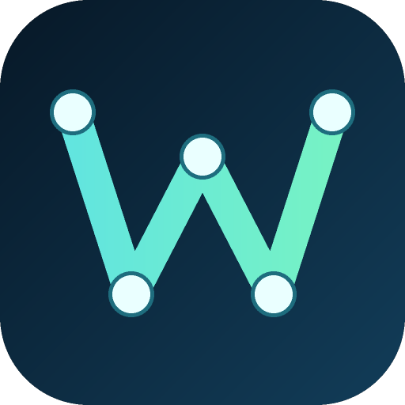
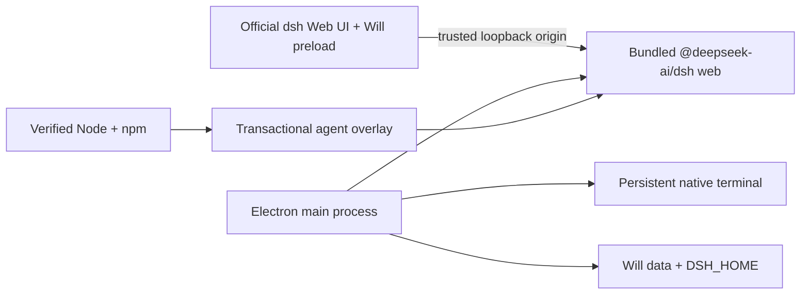

# Deepseek Harness Will — 组装未来

English | [中文](README.zh.md)

<p align="center">
  
</p>

**Deepseek Harness Will — 组装未来** is an **unofficial, community-maintained desktop distribution** of [DeepSeek Harness](https://github.com/deepseek-ai/deepseek-harness). It packages the official `dsh web` profile as a Windows and macOS application, then adds opt-in desktop features without changing the upstream default theme.

This project is not affiliated with or endorsed by DeepSeek. DeepSeek Harness remains in developer preview, so compatibility-breaking upstream changes are expected.

## Problem it solves

The official Web profile is designed for developers who can install Node.js, run a command, and keep a browser tab open. Deepseek Harness Will — 组装未来 turns that workflow into a double-click desktop app with its own verified Node/npm runtime, persistent background process, native window controls, tray residency, settings UI, and release packages. Users can operate the official Harness UI without maintaining a separate Node.js installation or browser session.

## Main features

| Capability | Status | Implementation |
|---|---|---|
| Windows and macOS packages | Implemented | Windows 10/11 x64 installer and portable executable; macOS 12+ DMGs for Apple Silicon and Intel. |
| Application name | Implemented | The installed application, window, tray, notification, and shortcut name is **Deepseek Harness Will — 组装未来**; the repository and release artifact names remain DeepSeek Harness Will. |
| No user-installed Node.js | Implemented | Electron runs the bundled agent; releases also carry a checksum-verified Node/npm distribution for agent overlay updates. |
| Native desktop window | Implemented | Windows uses custom frameless chrome; macOS uses native inset traffic-light controls. Both support single-instance behavior and tray residency. |
| Portable mode | Windows | The portable executable stores data in `DeepSeek-Harness-Will-Data` beside the executable. macOS uses the installed application data directory. |
| UI skins | Implemented | Native upstream mode plus 10 mutually exclusive palettes: Windows XP, QQ98, Miku Future, Minecraft, Tonghuashun, Whale Song, Dunhuang, Cyber Neon, Paper Minimal, and Aurora. |
| Balance widget | Implemented | The main process queries DeepSeek's official `/user/balance` endpoint; the API key never crosses renderer IPC. |
| `soul.md` editor | Implemented | Projects the persona into a Will-owned dsh patch and does not overwrite the upstream profile patch. |
| Persistent terminal | Implemented | Uses PowerShell on Windows and the login shell on macOS; it survives Web page reloads and tray hiding and replays the latest 128 KiB. |
| Plugin management | Implemented | Installs/removes dsh profile packages with an explicit arbitrary-code warning and restarts Harness safely. |
| Agent updates | Implemented | Transactional `@deepseek-ai/dsh@latest` overlay with health check and one-version rollback. |
| Client updates | Platform-specific | Windows supports consent-gated GitHub Release updates. macOS updates are downloaded manually from GitHub Releases. |
| Task notification | Implemented | Sends an operating-system notification when a visible agent run transitions to idle while the app is not focused. |
| Models, MCP, sessions, diff cards | Upstream | Reuses the official Web profile and its durable session, terminal, and file-diff services. |
| Per-file/whole-session one-click restore | Planned | Diff display exists upstream; mutation rollback is not exposed as a Will action yet. |
| Codex/Claude automatic migration | Planned | `skills`, MCP, and memory can be configured through dsh today; automated import remains future work. |

## Runtime design



The derivative uses the official loopback Web carrier on `127.0.0.1` so it can track upstream with a small change surface. The upstream architecture reserves a direct Electron IPC carrier; moving to it is deferred until that provider exists upstream.

## Installation

Download artifacts from the repository's [GitHub Releases](https://github.com/vagaryyuofficial/DeepSeek-Harness-Will/releases) page. A separate Node.js installation is not required.

### Windows 10/11 x64

1. Download `DeepSeek-Harness-Will-Setup-<version>-x64.exe` for a normal installation, or `DeepSeek-Harness-Will-Portable-<version>-x64.exe` for portable use.
2. Run the file and follow the installer when applicable.
3. Keep the portable executable and its `DeepSeek-Harness-Will-Data` directory together when moving it.

### macOS 12 or later

1. Choose `DeepSeek-Harness-Will-<version>-macOS-arm64.dmg` for Apple Silicon (M1 or later), or `DeepSeek-Harness-Will-<version>-macOS-x64.dmg` for an Intel Mac.
2. Open the DMG and drag **Deepseek Harness Will — 组装未来** to **Applications**.
3. Open the application from **Applications**. The current builds are unsigned and not notarized; on first launch, Control-click the app and choose **Open**, or approve it in **System Settings → Privacy & Security** after verifying that it came from this repository.

<a id="run"></a>

## Usage

1. Start **Deepseek Harness Will — 组装未来**.
2. In the official **Settings → Models** page, choose a model and save the required API key.
3. Enter a task in the official chat composer and follow the streamed response, tool calls, terminal output, and file diff cards.
4. Open **组装未来设置** in the title bar to select a skin, edit `soul.md`, manage plugins, use the persistent terminal, check balance, or configure desktop behavior.
5. Closing the window keeps the app in the tray when **close to tray** is enabled; use the tray menu to return or quit.

### Input and output examples

Chat input:

> Read the root `package.json` and tell me its `name` field. Do not modify files.

Typical streamed output after a model is configured (wording varies by model):

> The `name` field is `@deepseek-ai/dsh-root`. No files were modified.

Persistent terminal input:

```text
echo will-ready
```

Terminal output:

```text
will-ready
```

<a id="run-from-source"></a>

## Develop from source

Requirements: Node.js 24, pnpm 11.7, and the toolchains required by upstream DeepSeek Harness.

```sh
git clone https://github.com/vagaryyuofficial/DeepSeek-Harness-Will.git
cd DeepSeek-Harness-Will
pnpm install --frozen-lockfile
pnpm run build
pnpm run will:dev
```

Focused checks and local packages:

```sh
pnpm --filter @deepseek-harness-will/desktop run test
pnpm --filter @deepseek-harness-will/desktop run build
pnpm run will:package:mac
pnpm run will:package:win
```

GitHub Actions builds Windows x64, macOS Apple Silicon, and macOS Intel artifacts on their native runner architectures. Each job downloads Node from `nodejs.org`, verifies the archive against `SHASUMS256.txt`, and packages the matching standalone runtime. A `will-v*` tag publishes all platform artifacts in one GitHub Release.

## Data and updates

- Installed mode retains the existing per-user `DeepSeek Harness Will` data directory so upgrading to the `Deepseek Harness Will — 组装未来` display name does not hide prior settings or sessions.
- Windows portable mode uses `DeepSeek-Harness-Will-Data` beside the executable.
- The dsh home, Will preferences, `soul.md`, terminal state, and agent overlays live below the selected root.
- Agent updates install into staging, run `dsh --version`, rotate `current`/`previous`, and restart. A failed restart restores the previous overlay.
- Windows client updates download only after the user confirms the discovered version and install only after Harness and the terminal stop. macOS client releases are installed manually from a new DMG.

## Security boundaries

- Harness binds to `127.0.0.1` on an ephemeral port. Desktop IPC rejects renderer calls whose origin does not match that exact Harness origin.
- Context isolation is enabled and Node integration is disabled in the renderer.
- The balance API key is read by the main process and only sanitized balances reach the page.
- dsh plugins are executable local dependencies. Install only packages you trust.
- `soul.md` is limited to 64 KiB and writes only a Will-owned patch.
- Release packages are currently unsigned. Verify that downloads come from this repository before opening them.

Please report security issues privately to the maintainers before opening a public issue.

## Keeping the derivative current

The original remote is retained as `upstream`:

```sh
git fetch upstream
git merge upstream/master
pnpm install --frozen-lockfile
pnpm run build
```

Will-specific code lives under `apps/will-desktop`, with only small workspace-script, lockfile, documentation, and workflow additions elsewhere.

## Contributing

Read [CONTRIBUTING.md](CONTRIBUTING.md), [AGENTS.md](AGENTS.md), and the upstream [architecture documentation](docs/architecture.md). Keep changes in the desktop application when the behavior is distribution-specific; avoid patching upstream packages unless the capability is generally useful to DeepSeek Harness.

## License and names

Licensed under [MIT](LICENSE). Upstream DeepSeek Harness source remains under its MIT license, and third-party disclosures are in [THIRD_PARTY_NOTICES.md](THIRD_PARTY_NOTICES.md).

“DeepSeek” and related names may be trademarks of their respective owners. The Will icon is an original abstract W/harness-node design and does not reuse the official DeepSeek logo.
