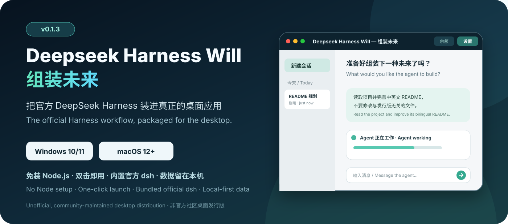
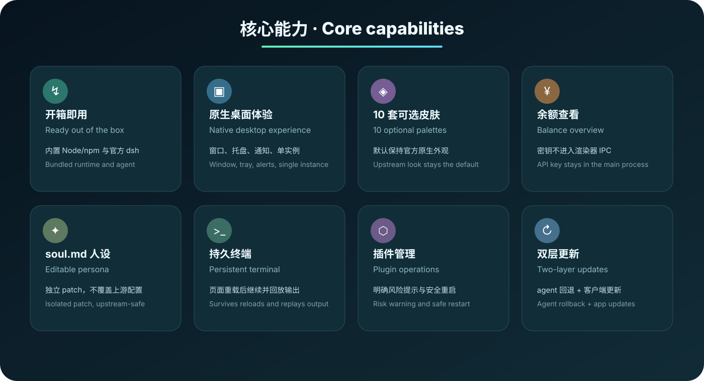
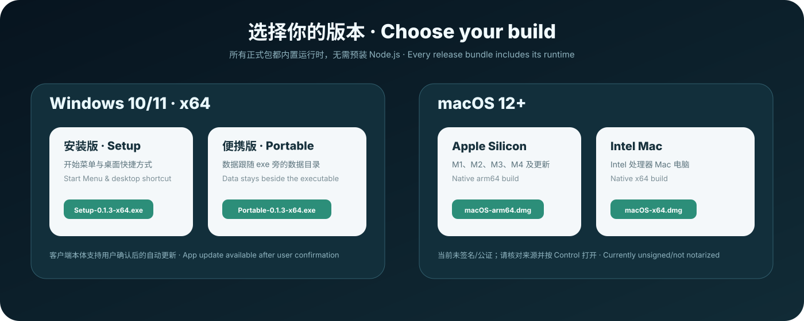
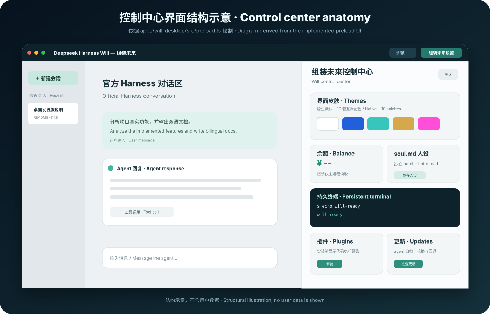
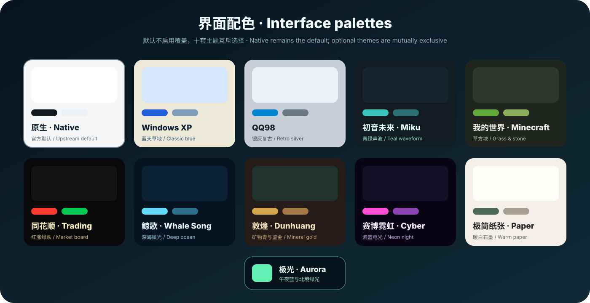
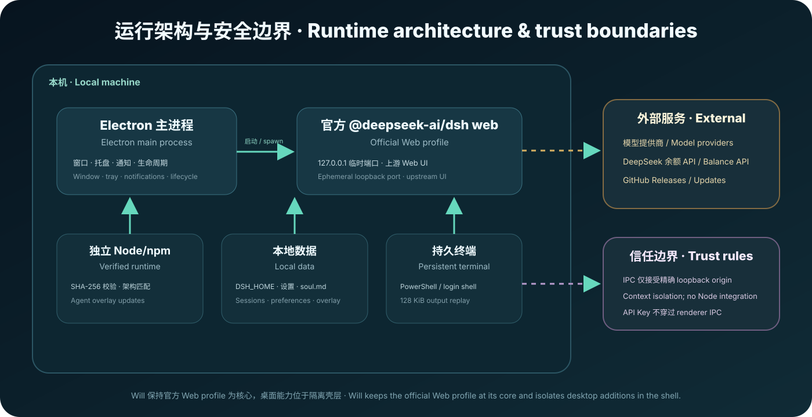

# Deepseek Harness Will — 组装未来

[English](README.md) | 中文 | 本页逐节中英对照 · Fully bilingual on this page

<p align="center">
  
</p>

<p align="center">
  <a href="https://github.com/vagaryyuofficial/DeepSeek-Harness-Will/releases/latest">下载最新版 · Download</a>
  ·
  <a href="#下载安装--download--install">安装说明 · Install</a>
  ·
  <a href="#功能详解--feature-guide">功能详解 · Features</a>
  ·
  <a href="#常见问题--faq">常见问题 · FAQ</a>
</p>

> 本 README 采用逐节中英文对照；中文在前，英文紧随其后。
>
> This README is fully bilingual. Every Chinese section is followed by its English counterpart.

**Deepseek Harness Will — 组装未来**是 [DeepSeek Harness](https://github.com/deepseek-ai/deepseek-harness) 的非官方、社区维护桌面发行版。它将官方 `dsh web` profile、匹配平台架构的 Node/npm 运行时与 Electron 桌面壳封装为 Windows 和 macOS 安装包，并在不改变上游默认外观的前提下提供可选桌面能力。

**Deepseek Harness Will — 组装未来** is an unofficial, community-maintained desktop distribution of [DeepSeek Harness](https://github.com/deepseek-ai/deepseek-harness). It packages the official `dsh web` profile, an architecture-matched Node/npm runtime, and an Electron shell for Windows and macOS, with opt-in desktop additions that leave the upstream appearance unchanged by default.

本项目与 DeepSeek 没有关联，也未得到其背书。DeepSeek Harness 仍处于开发者预览阶段，上游升级可能包含破坏性变更。

This project is not affiliated with or endorsed by DeepSeek. DeepSeek Harness is still a developer preview, and upstream updates may include breaking changes.

## 目录 · Contents

- [项目解决什么问题 · Problem](#项目解决什么问题--the-problem)
- [与官方版本对比 · Comparison](#与官方版本对比--comparison-with-upstream)
- [下载安装 · Download & install](#下载安装--download--install)
- [首次使用 · First run](#首次使用--first-run)
- [功能详解 · Feature guide](#功能详解--feature-guide)
- [真实能力边界 · Implemented scope](#真实能力边界--implemented-scope)
- [输入输出示例 · Examples](#输入输出示例--input--output-examples)
- [数据、隐私与安全 · Data, privacy & security](#数据隐私与安全--data-privacy--security)
- [从源码构建 · Build from source](#从源码构建--build-from-source)
- [常见问题 · FAQ](#常见问题--faq)
- [许可证与名称 · License & names](#许可证与名称--license--names)

## 项目解决什么问题 · The problem

官方 Web profile 面向熟悉 Node.js、命令行和浏览器开发流程的用户：需要安装运行时、执行 `npx @deepseek-ai/dsh web`，再持续保留浏览器标签页。组装未来把这条链路变成双击即可启动的桌面应用，并负责窗口、后台进程、托盘、通知、数据目录与发行包。

The official Web profile assumes a developer workflow: install Node.js, run `npx @deepseek-ai/dsh web`, and keep a browser tab open. Will turns that chain into a double-click desktop application that owns the window, background process, tray, notifications, data location, and distributable packages.

它不是另一套 agent 内核。对话、模型、MCP、会话与工具系统仍来自官方 DeepSeek Harness；Will 只在外层增加发行和桌面体验，因此更容易跟随上游。

It is not a replacement agent core. Conversations, models, MCP, sessions, and the tool system still come from official DeepSeek Harness. Will adds distribution and desktop behavior around that core, keeping the derivative easier to update.

<p align="center">
  
</p>

## 与官方版本对比 · Comparison with upstream

| 能力 / Capability | 官方 `dsh web` / Official | 组装未来 / Will |
|---|---|---|
| 启动方式 / Launch | 安装 Node.js 后运行命令并打开浏览器 / Install Node.js, run a command, open a browser | 内置运行时与 agent，双击启动 / Bundled runtime and agent, double-click launch |
| 支持平台 / Platforms | Windows、macOS、Linux，需要 Node.js / Windows, macOS, Linux with Node.js | Windows 10/11 x64；macOS 12+ arm64/x64 / Windows 10/11 x64; macOS 12+ arm64/x64 |
| 窗口体验 / Window | 浏览器标签页 / Browser tab | 原生桌面窗口、单实例、托盘 / Native window, single instance, tray |
| 默认界面 / Default UI | 官方外观 / Upstream appearance | 默认仍是官方外观 / Still the upstream appearance by default |
| 可选主题 / Optional themes | 未提供发行版主题 / No distribution palettes | 10 套互斥 CSS token 配色 / 10 mutually exclusive token palettes |
| 便携数据 / Portable data | 手动管理目录 / Manual paths | Windows 便携版数据跟随 exe / Windows portable data beside the executable |
| 余额查看 / Balance | 手动访问开放平台 / Open the platform manually | 主进程调用官方余额 API / Main process calls the official balance API |
| 人设编辑 / Persona | 编辑配置文件 / Edit configuration files | 可视化编辑 `soul.md`，独立 patch / Edit `soul.md` with an isolated patch |
| 桌面终端 / Desktop terminal | 无桌面壳终端 / No shell-owned terminal | 持久 PowerShell 或登录 Shell / Persistent PowerShell or login shell |
| 插件操作 / Plugin operations | 使用 CLI / Use the CLI | 输入 package spec 安装或卸载 / Add or remove by package spec |
| agent 更新 / Agent update | 手动 npm 更新 / Manual npm update | staging、自检、原子轮换、失败回退 / Staging, verification, atomic rotation, rollback |
| 客户端更新 / App update | 不适用 / N/A | Windows 用户确认后更新；macOS 手动下载 / Consent-gated on Windows; manual on macOS |
| 任务通知 / Task notification | 无桌面系统通知 / No desktop notification | 后台任务完成时发送系统通知 / OS notification when an off-screen task settles |

> “内置运行时”表示目标电脑无需另装 Node.js；调用云端模型、查询余额、下载更新或安装插件仍需要网络。
>
> “Bundled runtime” means no separate Node.js installation is required. Cloud models, balance queries, updates, and plugin installation still require network access.

## 下载安装 · Download & install

当前稳定版是 **v0.1.3**。所有文件均由本仓库 GitHub Actions 在对应原生 runner 上构建；完整版本历史见 [Releases](https://github.com/vagaryyuofficial/DeepSeek-Harness-Will/releases)。

The current stable release is **v0.1.3**. Every package is built by this repository's GitHub Actions workflow on a matching native runner. See [Releases](https://github.com/vagaryyuofficial/DeepSeek-Harness-Will/releases) for the full history.

| 平台 / Platform | 文件与直接下载 / File & direct download | 适用场景 / Use case | 约大小 / Approx. |
|---|---|---|---|
| Windows 10/11 x64 | [安装版 Setup EXE](https://github.com/vagaryyuofficial/DeepSeek-Harness-Will/releases/download/will-v0.1.3/DeepSeek-Harness-Will-Setup-0.1.3-x64.exe) | 安装到系统，创建快捷方式 / System install with shortcuts | 165 MiB |
| Windows 10/11 x64 | [便携版 Portable EXE](https://github.com/vagaryyuofficial/DeepSeek-Harness-Will/releases/download/will-v0.1.3/DeepSeek-Harness-Will-Portable-0.1.3-x64.exe) | exe 与数据目录一起移动 / Move executable and data together | 165 MiB |
| macOS 12+ Apple Silicon | [arm64 DMG](https://github.com/vagaryyuofficial/DeepSeek-Harness-Will/releases/download/will-v0.1.3/DeepSeek-Harness-Will-0.1.3-macOS-arm64.dmg) | M1、M2、M3、M4 及更新 / M-series Macs | 213 MiB |
| macOS 12+ Intel | [x64 DMG](https://github.com/vagaryyuofficial/DeepSeek-Harness-Will/releases/download/will-v0.1.3/DeepSeek-Harness-Will-0.1.3-macOS-x64.dmg) | Intel 处理器 Mac / Intel Macs | 217 MiB |

<p align="center">
  
</p>

### Windows 10/11 x64

1. 日常使用请选择安装版；需要随 U 盘或目录移动请选择便携版。
2. 安装版按向导选择目录；便携版直接运行 EXE。
3. Windows SmartScreen 可能提示未知发布者，因为当前包尚未购买代码签名证书。请先核对下载地址属于本仓库，再决定是否运行。
4. 移动便携版时，让 EXE 与同目录的 `DeepSeek-Harness-Will-Data` 一起移动。

1. Choose Setup for normal use, or Portable when the app and data must move together.
2. Follow the installer wizard for Setup; launch the EXE directly for Portable.
3. Windows SmartScreen may show an unknown-publisher warning because the package is not code-signed yet. Verify that the download came from this repository before running it.
4. When moving Portable, keep `DeepSeek-Harness-Will-Data` beside the EXE.

### macOS 12 or later

1. “关于本机”显示 Apple M 系列芯片时下载 arm64；显示 Intel 时下载 x64。
2. 打开 DMG，将 **Deepseek Harness Will — 组装未来**拖到“应用程序”。
3. 当前 DMG 尚未签名或公证。确认文件来自本仓库后，按住 Control 点击应用并选择“打开”；也可以在“系统设置 → 隐私与安全性”批准。
4. macOS 客户端当前不自动安装新版，请从 Releases 下载新 DMG 覆盖安装；原数据目录保持不变。

1. Download arm64 for Apple M-series Macs and x64 for Intel Macs.
2. Open the DMG and drag **Deepseek Harness Will — 组装未来** into Applications.
3. The current DMGs are not signed or notarized. After verifying the source, Control-click the app and choose Open, or approve it under System Settings → Privacy & Security.
4. The macOS client does not install updates automatically yet. Download a new DMG from Releases and replace the app; existing data remains in place.

<a id="run"></a>

## 首次使用 · First run

1. 启动应用，等待标题栏状态变为“DeepSeek Harness 已就绪”。
2. 打开官方 **Settings → Models**，添加模型提供商、模型和所需 API Key。
3. 新建会话，选择工作目录，在输入框描述任务。
4. 需要桌面功能时点击标题栏“组装未来设置”。
5. 默认开启“关闭到托盘”；关闭窗口不会终止正在执行的 agent。请使用托盘菜单“退出”来完全结束应用。

1. Launch the app and wait until the title-bar status reports that DeepSeek Harness is ready.
2. Open official **Settings → Models** and configure a provider, model, and required API key.
3. Create a session, choose a working directory, and describe the task in the composer.
4. Select “组装未来设置” in the title bar for desktop-specific controls.
5. Close-to-tray is enabled by default. Closing the window does not stop an active agent; use Quit from the tray menu to end the application.

## 功能详解 · Feature guide

<p align="center">
  
</p>

> 上图根据当前 `preload.ts` 的真实功能结构绘制，不是运行截图，也不包含用户数据。
>
> The illustration above follows the implemented `preload.ts` structure. It is not a runtime screenshot and contains no user data.

### 1. 开箱即用 · Ready out of the box

- Electron 直接启动安装包内的官方 `@deepseek-ai/dsh web`。
- Harness 只绑定 `127.0.0.1` 的临时空闲端口，不暴露到局域网。
- 每个平台发行包包含对应架构的 Node/npm；GitHub Actions 下载后使用 `SHASUMS256.txt` 校验。
- 内置运行时主要服务于 agent overlay 更新；用户不需要维护系统 Node.js。

- Electron launches the packaged official `@deepseek-ai/dsh web` entry.
- Harness binds only to an ephemeral `127.0.0.1` port and is not exposed to the LAN.
- Each platform package includes a matching Node/npm runtime verified against `SHASUMS256.txt` during CI.
- The standalone runtime powers agent overlay updates; users do not maintain a system Node.js installation.

### 2. 原生桌面体验 · Native desktop experience

- Windows 使用自绘无边框标题栏；macOS 使用原生内嵌红黄绿窗口按钮。
- 单实例锁避免重复启动多个 Harness 后台服务。
- 系统托盘显示当前启动、更新或错误状态；点击可返回窗口。
- 开启任务通知后，应用不在前台且任务从运行转为空闲时发送系统通知。
- 退出时等待 Harness 与终端停止，减少孤儿进程。

- Windows uses a custom frameless title bar; macOS uses native inset traffic-light controls.
- A single-instance lock prevents duplicate Harness background services.
- The tray reports starting, update, ready, and error states and can restore the window.
- With task notifications enabled, an off-screen task settling from running to idle produces an OS notification.
- Quit waits for Harness and the terminal to stop, reducing orphan processes.

### 3. 十套可选配色 · Ten optional palettes

<p align="center">
  
</p>

这些主题是覆盖官方设计 token 的配色方案，不替换上游组件，也不安装第三方皮肤插件。默认选择“原生”，不会写入任何 Will 主题变量；选择其他主题时一次只启用一套。

These themes are palette overlays on official design tokens. They do not replace upstream components or install third-party skin plugins. Native is the default and writes no Will theme variables; only one optional palette is active at a time.

| ID | 显示名 / Label | 视觉方向 / Visual direction |
|---|---|---|
| `windows-xp` | Windows XP | 蓝天、草地与经典任务栏蓝 / Classic blue and grass |
| `qq98` | QQ98 | 银灰面板与复古网络蓝 / Retro silver and network blue |
| `miku-future` | 初音未来 / Miku | 青绿色声波与柔和深灰 / Teal waveform and charcoal |
| `minecraft` | 我的世界 / Minecraft | 草方块绿与石材灰 / Grass green and stone gray |
| `tonghuashun` | 同花顺 / Trading | 行情黑底、红涨绿跌 / Dark market board colors |
| `whale-song` | 鲸歌 / Whale Song | 深海蓝与鲸鸣微光 / Deep-ocean blue |
| `dunhuang` | 敦煌 / Dunhuang | 矿物青、赭石与鎏金 / Mineral teal, ochre, and gold |
| `cyber-neon` | 赛博霓虹 / Cyber Neon | 紫蓝夜色与洋红电光 / Purple night and magenta neon |
| `paper-minimal` | 极简纸张 / Minimal Paper | 暖白纸面与石墨线条 / Warm paper and graphite |
| `aurora` | 极光 / Aurora | 午夜蓝与北境绿光 / Midnight blue and aurora green |

### 4. DeepSeek 余额 · DeepSeek balance

控制中心调用 DeepSeek 官方 `/user/balance`，显示 CNY 或 USD 的充值、赠送与总余额。API Key 从 `DEEPSEEK_API_KEY` 或 Harness 凭据文件读取，只存在于 Electron 主进程；renderer 只接收清洗后的金额数据。未配置 DeepSeek Key 时显示“未配置”，不会影响其他模型提供商。

The control center calls DeepSeek's official `/user/balance` endpoint and displays topped-up, granted, and total CNY or USD balances. The API key is read from `DEEPSEEK_API_KEY` or the Harness credential file and remains in the Electron main process; the renderer receives only sanitized balance rows. An unconfigured DeepSeek key does not affect other providers.

### 5. `soul.md` 人设 · Persona editor

控制中心可以读取和保存最多 64 KiB 的 `soul.md`。保存时生成 Will 独占的 `desktop.patch.yml`，将内容投影到 `system-prompt` persona；不会覆盖官方 Web profile 的 patch。留空即不添加 Will persona。

The control center reads and saves a `soul.md` file up to 64 KiB. Saving projects the content into a Will-owned `desktop.patch.yml` entry for the `system-prompt` persona without overwriting the official Web profile patch. An empty file adds no Will persona.

### 6. 持久终端 · Persistent terminal

Windows 使用 PowerShell，macOS 使用用户登录 Shell。终端属于 Electron 主进程，因此关闭设置面板、刷新 Web UI 或隐藏到托盘都不会结束会话；重新打开时回放最近 128 KiB 输出。用户可以明确选择重启终端。

Windows uses PowerShell and macOS uses the user's login shell. The terminal belongs to the Electron main process, so closing the panel, reloading the Web UI, or hiding to the tray does not end it. Reopening replays up to 128 KiB of recent output, and users can explicitly restart the session.

### 7. 插件操作 · Plugin operations

输入 npm、GitHub 或本地 package spec 后，可以调用官方 `dsh plugin --profile web add/remove`。安装前会明确提示插件拥有本机代码执行能力，操作期间停止 Harness，完成或失败后都尝试安全恢复服务。当前实现是 package spec 管理器，**不是**带搜索目录的插件市场。

Enter an npm, GitHub, or local package spec to invoke official `dsh plugin --profile web add/remove`. Before installation, the UI warns that plugins can execute local code. Harness stops during the operation and is safely restarted after success or failure. The current implementation is a package-spec manager, **not** a searchable marketplace.

### 8. 双层更新 · Two-layer updates

**官方 agent：**内置 npm 将 `@deepseek-ai/dsh@latest` 安装到 staging，运行 `dsh --version` 自检，再原子轮换 `current` 与 `previous`。新版本启动失败时恢复上一 overlay。控制中心也提供手动回退。

**Official agent:** bundled npm installs `@deepseek-ai/dsh@latest` into staging, verifies it with `dsh --version`, then atomically rotates `current` and `previous`. A failed startup restores the former overlay, and the control center exposes manual rollback.

**桌面客户端：**Windows 通过 GitHub Releases 检查新版，只有用户确认后才下载并安装；macOS 当前提示用户手动下载 DMG。开发模式不执行客户端更新。

**Desktop client:** Windows checks GitHub Releases and downloads or installs only after user confirmation. macOS currently directs users to download a DMG manually. Development builds do not perform client updates.

### 9. 直接复用上游能力 · Upstream capabilities retained

以下能力由官方 DeepSeek Harness Web profile 提供，Will 不重新实现：模型与凭据配置、MCP、会话持久化、工具调用呈现、工作目录、官方终端/文件服务以及文件 diff 卡片。其具体行为随打包的上游版本变化。

The official DeepSeek Harness Web profile continues to provide model and credential settings, MCP, session persistence, tool-call presentation, workspaces, official terminal/file services, and file-diff cards. Will does not reimplement them, and their exact behavior follows the bundled upstream version.

## 真实能力边界 · Implemented scope

为了让 GitHub 介绍与代码一致，下面区分已实现、来自上游与规划能力。

To keep the project page aligned with the code, this table distinguishes implemented, upstream, and planned behavior.

| 能力 / Capability | 状态 / Status | 说明 / Notes |
|---|---|---|
| Windows 安装版与便携版 / Windows Setup & Portable | 已实现 / Implemented | x64 |
| macOS Apple Silicon 与 Intel DMG | 已实现 / Implemented | macOS 12+, arm64/x64 |
| 10 套主题配色 / 10 palettes | 已实现 / Implemented | CSS token overlays, native default |
| 余额、`soul.md`、持久终端 / Balance, persona, terminal | 已实现 / Implemented | Desktop control center |
| package spec 插件安装/卸载 / Package-spec plugin add/remove | 已实现 / Implemented | 带代码执行警告 / With code-execution warning |
| agent 更新与回退 / Agent update & rollback | 已实现 / Implemented | Transactional overlay |
| Windows 客户端更新 / Windows app update | 已实现 / Implemented | 必须用户确认 / Requires consent |
| macOS 客户端自动安装 / macOS automatic install | 未实现 / Not implemented | 当前手动下载 DMG / Manual DMG update |
| 模型、MCP、会话、diff 卡片 / Models, MCP, sessions, diff cards | 上游 / Upstream | Official Web profile |
| 单文件或整会话一键还原 / One-click file/session restore | 规划中 / Planned | 当前只有上游 diff 展示 / Diff display only today |
| Codex/Claude 自动迁移 / Automatic Codex/Claude migration | 规划中 / Planned | 当前需手动配置 / Manual configuration today |
| 搜索式插件市场 / Searchable plugin marketplace | 未实现 / Not implemented | 当前输入 package spec / Package spec input today |
| Linux 桌面安装包 / Linux desktop packages | 未实现 / Not implemented | 官方 CLI 仍可在 Linux 使用 / Official CLI remains available |

## 输入输出示例 · Input & output examples

### 对话任务 · Conversation task

输入 / Input:

> 读取根目录 `package.json`，告诉我 `name` 字段，不要修改文件。
>
> Read the root `package.json`, report the `name` field, and do not modify files.

配置模型后的典型流式输出 / Typical streamed output after model setup:

> `name` 字段是 `@deepseek-ai/dsh-root`。没有修改文件。
>
> The `name` field is `@deepseek-ai/dsh-root`. No files were changed.

实际措辞、工具调用与费用取决于所选模型、provider 和项目内容。

Exact wording, tool calls, and cost depend on the selected model, provider, and workspace.

### 持久终端 · Persistent terminal

输入 / Input:

```text
echo will-ready
```

输出 / Output:

```text
will-ready
```

## 数据、隐私与安全 · Data, privacy & security

<p align="center">
  
</p>

### 数据目录 · Data locations

| 模式 / Mode | 根目录 / Root | 行为 / Behavior |
|---|---|---|
| Windows 安装版 / Installed Windows | `%APPDATA%\DeepSeek Harness Will` | 保持旧版本兼容 / Preserves legacy compatibility |
| macOS 安装版 / Installed macOS | `~/Library/Application Support/DeepSeek Harness Will` | 显示名变化不迁移目录 / Display-name change does not relocate data |
| Windows 便携版 / Portable Windows | EXE 旁 `DeepSeek-Harness-Will-Data` | 移动时与 EXE 一起复制 / Copy beside the EXE |
| 显式覆盖 / Explicit override | `WILL_DATA_DIR` | 面向开发与测试 / Development and test use |

根目录内主要内容：

- `harness/`：Will 专用 `DSH_HOME`、profile、会话和凭据。
- `will/settings.json`：主题、关闭到托盘与通知偏好。
- `will/soul.md` 与 `will/desktop.patch.yml`：人设源文件及投影。
- `will/agent-overlay/current` 与 `previous`：当前和可回退 agent。
- `will/runtime-bin`：桌面端创建的 pnpm shim。

Key entries below the root:

- `harness/`: Will-specific `DSH_HOME`, profiles, sessions, and credentials.
- `will/settings.json`: theme, close-to-tray, and notification preferences.
- `will/soul.md` and `will/desktop.patch.yml`: persona source and projection.
- `will/agent-overlay/current` and `previous`: active and rollback agents.
- `will/runtime-bin`: the desktop-managed pnpm shim.

### 安全边界 · Security boundaries

- Harness 仅监听 `127.0.0.1`；Will IPC 拒绝非精确 Harness origin。
- renderer 开启 context isolation 并关闭 Node integration。
- DeepSeek API Key 不通过 renderer IPC；余额响应先进行字段与币种清洗。
- 设置和 `soul.md` 使用原子替换写入；目录权限尽可能设为仅用户可读写。
- 插件是可执行本地依赖，只安装你理解并信任的来源。
- 当前产物未签名；运行前核对 GitHub 仓库、标签和文件名。

- Harness listens only on `127.0.0.1`; Will IPC rejects senders outside the exact Harness origin.
- The renderer uses context isolation with Node integration disabled.
- The DeepSeek API key never crosses renderer IPC; balance fields and currencies are sanitized first.
- Settings and `soul.md` use atomic replacement, and directories are created with user-only permissions where supported.
- Plugins are executable local dependencies. Install only sources you understand and trust.
- Current packages are unsigned. Verify the GitHub repository, tag, and filename before running them.

安全问题请优先私下联系维护者，不要在公开 issue 中披露凭据、个人路径或漏洞细节。

For security reports, contact the maintainer privately first. Do not disclose credentials, personal paths, or exploit details in a public issue.

<a id="run-from-source"></a>

## 从源码构建 · Build from source

要求 / Requirements:

- Node.js 24
- pnpm 11.7
- 官方 DeepSeek Harness 所需的本机构建工具 / Native build tools required by upstream Harness

```sh
git clone https://github.com/vagaryyuofficial/DeepSeek-Harness-Will.git
cd DeepSeek-Harness-Will
pnpm install --frozen-lockfile
pnpm run build
pnpm run will:dev
```

桌面端专项验证 / Desktop-specific validation:

```sh
pnpm --filter @deepseek-harness-will/desktop run test
pnpm --filter @deepseek-harness-will/desktop run build
pnpm run will:package:mac
pnpm run will:package:win
```

`will:package:mac` 需要 macOS；`will:package:win` 需要 Windows。正式工作流分别使用 Windows x64、macOS arm64 与 macOS x64 runner，封装匹配架构的独立运行时。推送 `will-v*` tag 后，三平台产物会进入同一个 Release。

`will:package:mac` requires macOS and `will:package:win` requires Windows. The release workflow uses Windows x64, macOS arm64, and macOS x64 runners and packages matching standalone runtimes. A `will-v*` tag publishes all platform assets into one Release.

### 发行版目录 · Distribution layout

```text
apps/will-desktop/
├── src/
│   ├── main.ts             Electron 生命周期、IPC、托盘、通知与更新
│   ├── preload.ts          标题栏与组装未来控制中心
│   ├── harness.ts          官方 dsh web 子进程管理
│   ├── store.ts            设置、soul.md、patch 与余额查询
│   ├── terminal.ts         持久 PowerShell / login shell
│   ├── agent-update.ts     事务式 agent overlay 更新与回退
│   └── theme-catalog.ts    原生模式与 10 套主题 token
├── tests/                  设置、主题、终端与打包契约测试
├── runtime/                CI 写入的独立 Node/npm 运行时
├── scripts/                构建与图标脚本
└── package.json            electron-builder 平台配置
```

The desktop shell remains concentrated under `apps/will-desktop`. Other repository changes are limited to workspace scripts, lockfile entries, documentation, and the release workflow so upstream synchronization stays reviewable.

桌面壳集中在 `apps/will-desktop`。仓库其他位置只保留必要的工作区脚本、锁文件、文档与发布工作流，便于审查上游同步。

## 更新上游 · Keeping up with upstream

本地 `upstream` 应指向官方仓库：

The local `upstream` remote should point to the official repository:

```sh
git fetch upstream
git merge upstream/master
pnpm install --frozen-lockfile
pnpm run build
```

上游仍处于预览阶段。合并后应至少运行仓库类型检查、桌面单元测试、桌面构建、文档校验与三平台 GitHub Actions。

Upstream is still a preview. After a merge, run repository type checking, desktop unit tests, the desktop build, documentation checks, and all three platform jobs.

## 常见问题 · FAQ

### 为什么没有 Linux 安装包？ · Why is there no Linux installer?

v0.1.3 的发行矩阵只有 Windows x64 与 macOS arm64/x64。Linux 用户仍可按照上游方法运行 `dsh web`；Linux 桌面封装尚未实现。

The v0.1.3 release matrix covers Windows x64 and macOS arm64/x64 only. Linux users can still run upstream `dsh web`; a Will Linux desktop package is not implemented yet.

### macOS 为什么提示应用无法验证？ · Why does macOS say the app cannot be verified?

当前项目没有 Apple Developer ID，DMG 未签名、未公证。请只从本仓库 Release 下载，核对后使用 Control-click → Open。不要从第三方网盘运行重新打包的副本。

The project does not currently have an Apple Developer ID, so DMGs are unsigned and not notarized. Download only from this repository, verify the source, then use Control-click → Open. Avoid repackaged copies from third-party mirrors.

### 为什么余额显示“未配置”？ · Why is balance “unconfigured”?

余额只支持 DeepSeek 官方 API Key。请在官方 Settings → Models 中保存 `DEEPSEEK_API_KEY`；使用其他 provider 时对话可以正常工作，但不会产生 DeepSeek 余额数据。

Balance requires an official DeepSeek API key. Save `DEEPSEEK_API_KEY` under official Settings → Models. Conversations through other providers can work normally, but no DeepSeek balance is available.

### 关闭窗口后任务为什么还在运行？ · Why does work continue after closing the window?

“关闭到托盘”默认开启。关闭窗口只隐藏界面；从托盘重新打开，或在托盘菜单选择“退出”来停止应用。

Close-to-tray is enabled by default. Closing the window hides it; restore it from the tray, or choose Quit in the tray menu to stop the application.

### 便携版可以只复制 EXE 吗？ · Can I copy only the portable EXE?

首次运行前可以；运行后数据保存在旁边的 `DeepSeek-Harness-Will-Data`。要保留配置与会话，请一起复制 EXE 和该目录。

Before first run, yes. After use, data lives in `DeepSeek-Harness-Will-Data` beside the executable. Copy both the EXE and that directory to retain settings and sessions.

### 主题会修改官方源码吗？ · Do themes modify upstream source?

不会。主题只在运行页面上设置 Will 维护的 CSS token；“原生”模式移除全部覆盖。它们是配色方案，不是复制其他项目代码的完整皮肤。

No. Themes set Will-managed CSS tokens on the running page, and Native removes every override. They are palette definitions, not copied full skins from other projects.

### 插件市场在哪里？ · Where is the plugin marketplace?

当前没有搜索式市场。控制中心接受一个明确的 package spec 并执行安装/卸载。安装前请自行审查来源；插件拥有本机代码执行能力。

There is no searchable marketplace today. The control center accepts an explicit package spec for add/remove operations. Review the source before installation because plugins can execute local code.

## 参与贡献 · Contributing

请先阅读 [CONTRIBUTING.md](CONTRIBUTING.md)、[AGENTS.md](AGENTS.md) 与上游 [架构文档](docs/architecture.md)。发行版专属行为应留在桌面壳；普遍适用于 DeepSeek Harness 的改进应优先反馈给上游。

Read [CONTRIBUTING.md](CONTRIBUTING.md), [AGENTS.md](AGENTS.md), and the upstream [architecture guide](docs/architecture.md) first. Distribution-only behavior belongs in the desktop shell; generally useful Harness improvements should be proposed upstream.

提交 issue 时请包含操作系统、CPU 架构、安装包文件名、复现步骤和净化后的错误信息。不要上传 API Key、`.credentials.yaml`、完整会话或包含用户名的绝对路径。

When filing an issue, include the OS, CPU architecture, package filename, reproduction steps, and sanitized errors. Never upload API keys, `.credentials.yaml`, full sessions, or absolute paths containing usernames.

## 许可证与名称 · License & names

本项目采用 [MIT License](LICENSE)。上游 DeepSeek Harness 源码继续遵循其 MIT 许可证；第三方依赖披露见 [THIRD_PARTY_NOTICES.md](THIRD_PARTY_NOTICES.md)。

This project is licensed under the [MIT License](LICENSE). Upstream DeepSeek Harness remains under its MIT license, and bundled dependency disclosures are listed in [THIRD_PARTY_NOTICES.md](THIRD_PARTY_NOTICES.md).

“DeepSeek”等名称和标志可能属于各自权利人。本项目名称用于说明兼容关系，不表示官方合作或背书。Will 图标是原创的抽象 W/连接节点图形，未复用 DeepSeek 官方标志。

“DeepSeek” and related names or marks may belong to their respective owners. The project name describes compatibility and does not imply affiliation or endorsement. The Will icon is an original abstract W/connection-node design and does not reuse the official DeepSeek mark.
