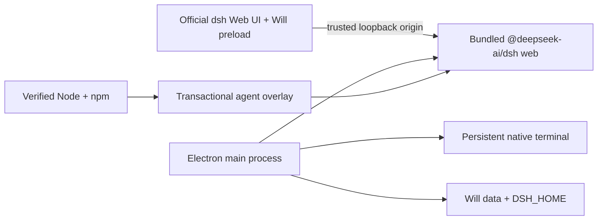

# Deepseek Harness Will — 组装未来

[English](README.md) | 中文

<p align="center">
  
</p>

**Deepseek Harness Will — 组装未来**是 [DeepSeek Harness](https://github.com/deepseek-ai/deepseek-harness) 的**非官方、社区维护桌面发行版**。它把官方 `dsh web` profile 封装为 Windows 与 macOS 应用，并在不改变上游默认主题的前提下加入可选桌面功能。

本项目与 DeepSeek 没有关联，也未得到其背书。DeepSeek Harness 仍处于开发者预览阶段，上游可能发生破坏兼容性的变更。

## 项目解决什么问题

官方 Web profile 面向能够安装 Node.js、运行命令并持续打开浏览器标签页的开发者。Deepseek Harness Will — 组装未来将这套流程封装为双击即用的桌面应用，内置经过校验的 Node/npm 运行时、持久后台进程、原生窗口控制、系统托盘、设置界面和发行安装包。用户无需维护独立 Node.js 环境或浏览器会话，也能使用官方 Harness 界面。

## 主要功能

| 能力 | 状态 | 实现方式 |
|---|---|---|
| Windows 与 macOS 安装包 | 已实现 | Windows 10/11 x64 安装版与便携版；macOS 12+ Apple Silicon 与 Intel 双架构 DMG。 |
| 应用名称 | 已实现 | 安装后的应用、窗口、托盘、通知和快捷方式统一显示**Deepseek Harness Will — 组装未来**；仓库与发行文件名保留 DeepSeek Harness Will。 |
| 用户免装 Node.js | 已实现 | Electron 运行内置 agent；发行包还携带经过 checksum 校验的 Node/npm，供 agent overlay 更新使用。 |
| 原生桌面窗口 | 已实现 | Windows 使用定制无边框窗口栏；macOS 使用原生内嵌红黄绿按钮；两端均支持单实例与托盘常驻。 |
| 便携模式 | Windows | 便携版在 exe 同目录的 `DeepSeek-Harness-Will-Data` 保存数据；macOS 使用安装模式的应用数据目录。 |
| 界面皮肤 | 已实现 | 官方原生模式加 10 套互斥皮肤：Windows XP、QQ98、初音未来、我的世界、同花顺、鲸歌、敦煌、赛博霓虹、极简纸张、极光。 |
| 余额小部件 | 已实现 | 主进程调用 DeepSeek 官方 `/user/balance`；API 密钥不会穿过 renderer IPC。 |
| `soul.md` 编辑 | 已实现 | 将人设投影到 Will 独占的 dsh patch，不覆盖上游 profile patch。 |
| 持久终端 | 已实现 | Windows 使用 PowerShell，macOS 使用登录 Shell；跨 Web 页面重载和托盘隐藏持续运行，并回放最近 128 KiB。 |
| 插件管理 | 已实现 | 显示任意代码执行警告后安装/卸载 dsh profile 包，并安全重启 Harness。 |
| agent 更新 | 已实现 | `@deepseek-ai/dsh@latest` 事务 overlay、自检与一个版本回退。 |
| 客户端更新 | 分平台 | Windows 支持用户确认后的 GitHub Release 自动更新；macOS 从 GitHub Releases 手动下载新版本。 |
| 任务通知 | 已实现 | 应用不在前台且可见 agent 任务从运行转为空闲时发送系统通知。 |
| 模型、MCP、会话、diff 卡片 | 复用上游 | 直接使用官方 Web profile 及其持久会话、终端和文件 diff 服务。 |
| 单文件/整会话一键还原 | 规划中 | 上游已有 diff 展示；Will 尚未暴露文件变更回滚动作。 |
| Codex/Claude 自动迁移 | 规划中 | 目前可在 dsh 配置 skills、MCP 与记忆；自动导入留待后续。 |

## 运行结构



当前衍生版沿用官方 `127.0.0.1` 回环 Web 载体，从而以较小改动面持续同步上游。上游架构已预留 Electron 原生 IPC 载体；在该 provider 正式落地前，本项目延后迁移。

## 安装方法

请从本仓库的 [GitHub Releases](https://github.com/vagaryyuofficial/DeepSeek-Harness-Will/releases) 页面下载发行产物，无需另行安装 Node.js。

### Windows 10/11 x64

1. 普通安装请选择 `DeepSeek-Harness-Will-Setup-<version>-x64.exe`，便携使用请选择 `DeepSeek-Harness-Will-Portable-<version>-x64.exe`。
2. 运行文件；安装版按向导完成安装。
3. 移动便携版时，请让 exe 与旁边的 `DeepSeek-Harness-Will-Data` 目录保持在一起。

### macOS 12 或更高版本

1. Apple Silicon（M1 或更新机型）选择 `DeepSeek-Harness-Will-<version>-macOS-arm64.dmg`；Intel Mac 选择 `DeepSeek-Harness-Will-<version>-macOS-x64.dmg`。
2. 打开 DMG，将**Deepseek Harness Will — 组装未来**拖入**应用程序**。
3. 从 **应用程序** 打开。本项目当前尚未签名和公证；首次启动前请确认文件来自本仓库，然后按住 Control 点击应用并选择**打开**，或在 **系统设置 → 隐私与安全性**中批准打开。

<a id="run"></a>

## 使用方法

1. 启动**Deepseek Harness Will — 组装未来**。
2. 在官方 **Settings → Models** 页面选择模型并保存所需 API 密钥。
3. 在官方对话输入框提交任务，查看流式回复、工具调用、终端输出和文件 diff 卡片。
4. 点击标题栏**组装未来设置**，选择皮肤、编辑 `soul.md`、管理插件、使用持久终端、查询余额或配置桌面行为。
5. 启用**关闭到托盘**后，关闭窗口不会终止任务；可从托盘菜单返回或退出。

### 输入输出示例

对话输入：

> 读取根目录 `package.json`，告诉我 `name` 字段，不要修改文件。

配置模型后的典型流式输出（具体措辞由模型决定）：

> `name` 字段是 `@deepseek-ai/dsh-root`。没有修改文件。

持久终端输入：

```text
echo will-ready
```

终端输出：

```text
will-ready
```

<a id="run-from-source"></a>

## 从源码开发

要求：Node.js 24、pnpm 11.7，以及上游 DeepSeek Harness 所需工具链。

```sh
git clone https://github.com/vagaryyuofficial/DeepSeek-Harness-Will.git
cd DeepSeek-Harness-Will
pnpm install --frozen-lockfile
pnpm run build
pnpm run will:dev
```

专项检查与本地打包：

```sh
pnpm --filter @deepseek-harness-will/desktop run test
pnpm --filter @deepseek-harness-will/desktop run build
pnpm run will:package:mac
pnpm run will:package:win
```

GitHub Actions 在对应原生架构 runner 上构建 Windows x64、macOS Apple Silicon 和 macOS Intel 产物。每个 job 都从 `nodejs.org` 下载 Node，以 `SHASUMS256.txt` 校验压缩包，并封装匹配架构的独立运行时。推送 `will-v*` tag 后，所有平台产物会进入同一个 GitHub Release。

## 数据与更新

- 安装模式保留原有的系统用户 `DeepSeek Harness Will` 数据目录，因此升级为「Deepseek Harness Will — 组装未来」显示名后不会丢失旧设置或会话。
- Windows 便携模式使用 exe 同目录的 `DeepSeek-Harness-Will-Data`。
- dsh home、Will 偏好、`soul.md`、终端状态和 agent overlay 均位于选定根目录下。
- agent 更新先安装到 staging，执行 `dsh --version`，再轮换 `current`/`previous` 并重启；新版本启动失败会恢复上一 overlay。
- Windows 客户端发现新版本后必须由用户确认才下载，并在 Harness 与终端停止后安装；macOS 客户端通过新 DMG 手动安装。

## 安全边界

- Harness 仅绑定 `127.0.0.1` 的临时端口。桌面 IPC 会拒绝来源与该 Harness origin 不完全相同的 renderer 调用。
- renderer 启用上下文隔离并关闭 Node integration。
- 余额 API 密钥只由主进程读取，页面只能得到净化后的余额数据。
- dsh 插件属于可执行本地依赖，只安装你信任的包。
- `soul.md` 上限为 64 KiB，并且只写入 Will 独占 patch。
- 当前发行包尚未签名，打开前请确认下载来自本仓库。

安全问题请先私下联系维护者，不要直接提交公开 issue。

## 同步上游

官方远程仓库保留为 `upstream`：

```sh
git fetch upstream
git merge upstream/master
pnpm install --frozen-lockfile
pnpm run build
```

Will 专属代码集中在 `apps/will-desktop`，仓库其他位置仅增加少量工作区脚本、锁文件、文档和工作流配置。

## 参与贡献

请阅读 [CONTRIBUTING.md](CONTRIBUTING.md)、[AGENTS.md](AGENTS.md) 与上游 [架构文档](docs/architecture.md)。发行版专属行为应尽量留在桌面应用内；只有普遍适用于 DeepSeek Harness 的能力才应修改上游 package。

## 许可证与名称

本项目采用 [MIT](LICENSE)。上游 DeepSeek Harness 源码继续遵循其 MIT 许可证，第三方依赖披露见 [THIRD_PARTY_NOTICES.md](THIRD_PARTY_NOTICES.md)。

“DeepSeek”等相关名称可能属于各自权利人。Will 图标是原创的抽象 W/连接节点设计，未复用 DeepSeek 官方标志。
