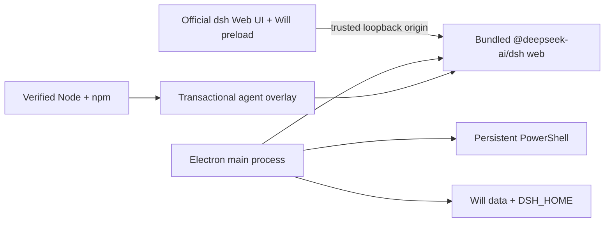

# DeepSeek Harness Will

[English](README.md) | 中文

<p align="center">
  
</p>

DeepSeek Harness Will 是 [DeepSeek Harness](https://github.com/deepseek-ai/deepseek-harness) 的**非官方、社区维护桌面发行版**。它把官方 `dsh web` profile 封装为 Windows 10/11 x64 桌面应用，并在不改变上游默认主题的前提下加入可选桌面功能。

本项目与 DeepSeek 没有关联，也未得到其背书。DeepSeek Harness 仍处于开发者预览阶段，上游可能发生破坏兼容性的变更。

## 当前状态

DeepSeek Harness Will 目前是早期预览版。仓库已能完成构建，桌面专项单元测试在 macOS 通过；安装包与便携包以 Windows 工作流产物为准。

| 能力 | 状态 | 实现方式 |
|---|---|---|
| 用户免装 Node.js | 已实现 | Electron 运行内置 agent；发行包还携带经过校验的 Node/npm，供 agent overlay 更新使用。 |
| 原生桌面窗口 | 已实现 | 无边框玻璃标题栏、单实例、系统托盘、可选关闭到托盘。 |
| 便携模式 | 已实现 | 便携版在 exe 同目录的 `DeepSeek-Harness-Will-Data` 保存数据。 |
| 界面皮肤 | 已实现 | 官方原生模式加 10 套互斥皮肤：Windows XP、QQ98、初音未来、我的世界、同花顺、鲸歌、敦煌、赛博霓虹、极简纸张、极光。 |
| 余额小部件 | 已实现 | 主进程调用 DeepSeek 官方 `/user/balance`；API 密钥不会穿过 renderer IPC。 |
| `soul.md` 编辑 | 已实现 | 将人设投影到 Will 独占的 dsh patch，不覆盖上游 profile patch。 |
| 持久 PowerShell | 已实现 | 由主进程在项目目录托管；Web 页面重载、隐藏到托盘均不终止；IPC 流式输出并回放最近 128 KiB。 |
| 插件管理 | 已实现 | 显示任意代码执行警告后安装/卸载 dsh profile 包，并安全重启 Harness。 |
| 双重更新 | 已实现 | `@deepseek-ai/dsh@latest` 事务 overlay、自检与回退；用户确认后执行 GitHub Release 客户端更新。 |
| 任务通知 | 已实现 | 应用不在前台且可见 agent 任务从运行转为空闲时发送 Windows 通知。 |
| 模型、MCP、会话、diff 卡片 | 复用上游 | 直接使用官方 Web profile 及其持久会话、终端和文件 diff 服务。 |
| 单文件/整会话一键还原 | 规划中 | 上游已有 diff 展示；Will 尚未暴露文件变更回滚动作。 |
| Codex/Claude 自动迁移 | 规划中 | 目前可在 dsh 配置 skills、MCP 与记忆；自动导入留待后续。 |

## 运行结构



当前衍生版沿用官方 `127.0.0.1` 回环 Web 载体，从而以较小改动面持续同步上游。上游架构已预留 Electron 原生 IPC 载体；在该 provider 正式落地前，本项目有意延后迁移。

## 使用发行包

1. 打开本仓库 GitHub Releases 页面。
2. 下载 x64 安装版或便携版 `.exe`。
3. 第一次启动后，在官方 **Settings → Models** 中配置模型/API 密钥。
4. 点击标题栏 **Will 设置**，选择皮肤、编辑 `soul.md`、管理插件、打开 PowerShell 或调整桌面行为。

目前发行包尚未签名，在项目取得代码签名身份前 Windows SmartScreen 可能提示风险。请只从本仓库自己的 GitHub Release 下载并核对产物。

## 从源码开发

要求：Node.js 24、pnpm 11.7，以及上游 DeepSeek Harness 所需工具链。

```sh
git clone https://github.com/vagaryyuofficial/DeepSeek-Harness-Will.git
cd DeepSeek-Harness-Will
pnpm install --frozen-lockfile
pnpm run build
pnpm run will:dev
```

专项检查：

```sh
pnpm --filter @deepseek-harness-will/desktop run test
pnpm --filter @deepseek-harness-will/desktop run build
```

Windows GitHub Actions 工作流会从 `nodejs.org` 下载 Node，以发行版 `SHASUMS256.txt` 校验压缩包，为 Electron 重建原生依赖，并产出 NSIS 安装版和 x64 便携版。推送 `will-v*` tag 还会创建带自动更新元数据的 GitHub Release。

## 数据与更新

- 安装模式使用 Electron 的系统用户应用数据目录。
- 便携模式使用 exe 同目录的 `DeepSeek-Harness-Will-Data`。
- dsh home、Will 偏好、`soul.md`、终端状态和 agent overlay 均位于这一个选定根目录下。
- agent 更新先安装到 staging，执行 `dsh --version`，再轮换 `current`/`previous` 并重启；新版本启动失败会恢复上一 overlay。
- 客户端发现新版本后必须由用户确认才下载，并在内置 Harness 与 PowerShell 停止后安装。

## 安全边界

- Harness 仅绑定 `127.0.0.1` 的临时端口。桌面 IPC 会拒绝来源与该 Harness origin 不完全相同的 renderer 调用。
- renderer 启用上下文隔离并关闭 Node integration。
- 余额 API 密钥只由主进程读取，页面只能得到净化后的余额数据。
- dsh 插件属于可执行本地依赖，只安装你信任的包。
- `soul.md` 上限为 64 KiB，并且只写入 Will 独占 patch。

安全问题请先私下联系维护者，不要直接提交公开 issue。

## 同步上游

官方远程仓库保留为 `upstream`：

```sh
git fetch upstream
git merge upstream/master
pnpm install --frozen-lockfile
pnpm run build
```

Will 专属代码集中在 `apps/will-desktop`，仓库其他位置仅增加少量工作区脚本、锁文件、文档和工作流配置。

## 参与贡献

请阅读 [CONTRIBUTING.md](CONTRIBUTING.md)、[AGENTS.md](AGENTS.md) 与上游 [架构文档](docs/architecture.md)。发行版专属行为应尽量留在桌面应用内；只有普遍适用于 DeepSeek Harness 的能力才应修改上游 package。

## 许可证与名称

本项目采用 [MIT](LICENSE)。上游 DeepSeek Harness 源码继续遵循其 MIT 许可证，第三方依赖披露见 [THIRD_PARTY_NOTICES.md](THIRD_PARTY_NOTICES.md)。

“DeepSeek”等相关名称可能属于各自权利人。Will 图标是原创的抽象 W/连接节点设计，未复用 DeepSeek 官方标志。
